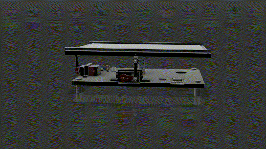

# Ball-Plate Nonlinear Control Test Bench

A self-built ball-and-plate test bench for comparing nonlinear control methods — PID vs. hyperbolic sliding mode control, with custom sensor filtering and a C++/ESP-IDF real-time control stack.

<!-- TODO: embed a GIF or short clip here, near the very top — this is the single most important piece of proof -->


---

## What is this?

A ball-and-plate system built as a personal research test bench for evaluating different control methods on a genuinely nonlinear, coupled system. Nonlinear behavior comes from the servo-to-plate linkage kinematics, build-tolerance coupling between the X and Y axes, low friction and inherent instability of the ball on the plate, and the shifting load from the ball's mass as it moves. This is an independent project, built outside of any coursework.

**Implemented so far:**
- PID (baseline, tuned empirically directly on the nonlinear plant)
- Hyperbolic sliding mode control (SMC) — robust nonlinear control, tuned to eliminate actuator chatter
- Custom deviation filter + Kalman filter for state estimation

**Tech stack:** C++ / ESP-IDF, ESP32-C6, custom PCB

📄 **[Read the full technical report](docs/technical-report.md)** — mechanical design, electronics, filtering, control design, and full PID vs. SMC results.

---

## Use Cases

- **Comparative control research** — a reusable, physical benchmark for testing and comparing classical vs. robust nonlinear control methods (currently PID and SMC; extensible to LQR, MPC, and beyond)
- **Nonlinear control education** — a hands-on platform for demonstrating concepts like state estimation, chattering, and controller robustness that are usually taught only in simulation
- **State estimation testing** — a real, noisy sensing environment for developing and validating filtering approaches (deviation filtering, Kalman filtering, and future IMU fusion)
- **Foundation for future robotics/control experiments** — the modular architecture (real-time control loop, HTTP connectivity, swappable controllers) is designed to extend to more advanced methods like MPC or learned/AI-based control

## Results at a glance

SMC consistently outperforms PID on this nonlinear plant — smaller error, faster convergence, and reliable tracking on curved paths where PID fails entirely.


Full breakdown, including the quantified results table, is in the [technical report](docs/technical-report.md#7-results--comparison).

---

## Repo structure

```
├── Components/        # C++ / ESP-IDF source (control, filtering, AppController)
├── docs/
│   ├── technical-report.md
│   └── images/         # graphs, renders, demo media
└── README.md
```

---

## Status

Actively evolving. Currently in progress / planned: IR-based position sensing to replace the resistive touch panel, IMU integration for bench misalignment compensation, and linearizing the model to test LQR/MPC. Full roadmap in the [Limitations & Future Work](docs/technical-report.md#8-limitations--future-work) section of the report.