# Ball-and-Plate Nonlinear Control Test Bench

> Personal research project. Test bench for evaluating different control methods on a nonlinear, coupled plant.
> Linked from the repo [README](../README.md).

---

## Table of Contents

1. [Overview](#1-overview)
2. [Mechanical Design & Kinematics](#2-mechanical-design--kinematics)
3. [Electronics & Wiring](#3-electronics--wiring)
4. [Coding Architecture](#4-coding-architecture)
5. [Filtering Systems](#5-filtering-systems)
6. [Control Systems](#6-control-systems)
7. [Results & Comparison](#7-results--comparison)
8. [Limitations & Future Work](#8-limitations--future-work)

## 1. Overview

This is a ball-and-plate system built as a test bench to compare the performance of different control methods on a nonlinear, coupled system. Several factors make it genuinely nonlinear: the servo-to-plate linkage kinematics are inherently nonlinear; small imperfections in the build couple the X and Y axes together; the plate has very low friction, making the ball's behavior inherently unstable; and the actuators experience a shifting load as the relatively heavy steel ball moves across the surface.

As an example of what the test bench can show, this report demonstrates that sliding mode control (SMC) performs substantially better than PID in this nonlinear environment, as shown in the results section below.

This is a personal, independent research project, built purely out of interest in the field of controls and research — outside of any coursework.

**Methods implemented on this test bench:**
- PID (baseline, tuned empirically directly on the nonlinear plant, no linearization step)
- Sliding mode control (SMC) with a hyperbolic tangent switching function to eliminate actuator wear and vibration — robust nonlinear control
- Custom deviation filter + Kalman filter for state estimation

**Planned next:** implementing additional control methods and linearizing the model to properly test linear methods like LQR; see Section 7 for the full roadmap.

---

## 2. Mechanical Design & Kinematics

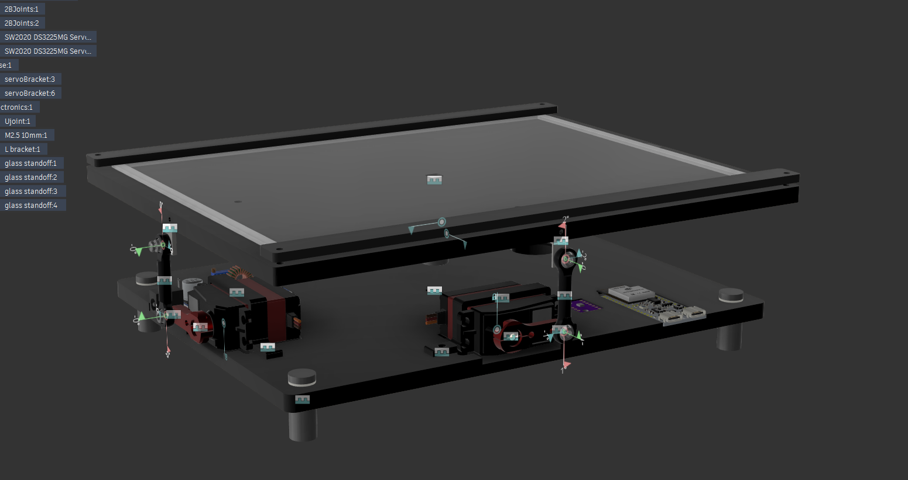
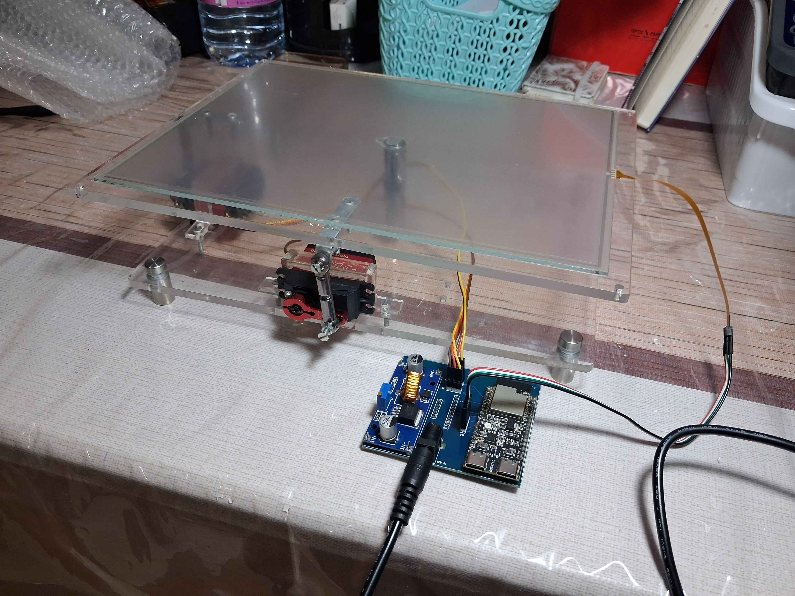

- **Degrees of freedom:** 2 (plate tilt about two axes)
- **Actuation:** DS3225 servos with ball-joint linkages
- **Ball position sensing:** resistive touch panel
- **Kinematics:** position is read as raw voltages, then converted into physical distance from the plate's center, in millimeters

**Known mechanical limitations:**
- The combined servo angle should not exceed 35°, or there's a risk of the linkage hitting the body
- The plate is not perfectly flat — it's laser-cut acrylic, which warped slightly
- The servo linkages are not preloaded, resulting in small backlash
- The central universal joint develops play under high load, due to its internal geometry (partially mitigated by tensioning the joint's core)

---

## 3. Electronics & Wiring

**MCU: ESP32-C6**

The ESP32-C6 was chosen primarily for connectivity. Rather than communicating over serial, the plan is for the system to expose an HTTP interface directly — the ESP32-C6 hosts its own server, so the control loop, telemetry, and future dashboard can all be reached over Wi-Fi without a wired connection to a host machine.

**Custom PCB**

To avoid a breadboard's worth of scattered jumper wires, a small custom PCB consolidates all the electronics onto a single board: the ESP32-C6, servo connections, and touch panel wiring all land on one carrier. The result is effectively plug-and-play — connect the power jack, and the whole system comes online, with no loose wiring to troubleshoot or reseat.

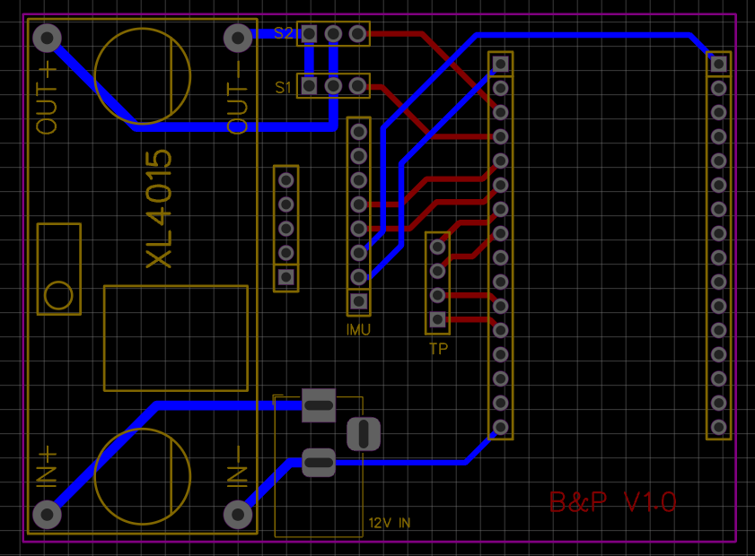
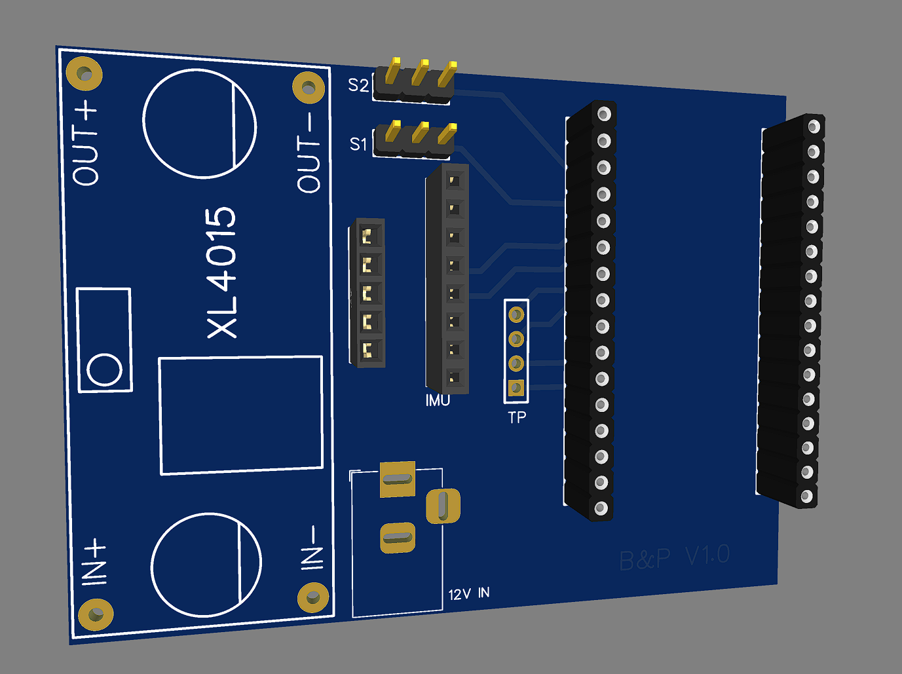

---

## 4. Coding Architecture

**Language/platform: C++ on ESP-IDF**

C++ and ESP-IDF were chosen deliberately: three years of a computer science bachelor's degree were spent on C++ and low-level systems and architecture, working toward mastering bare-metal programming. That background is a direct fit here, since the project runs a control loop at a demanding 250 Hz tick rate, with many samples processed per iteration.

- **Control loop:** runs at 250 Hz, chosen to match the response speed of the DS3225 servos
- **Data flow:** sensing → filtering → control → actuation, with each stage as its own task, sharing data between them
- **Architecture:** built with modularity in mind, every component runs as its own FreeRTOS task, each handling one part of the pipeline, all coordinated by a central `AppController`. The controller was designed to support multiple control methods and targeting modes, allowing real-time switching between tracking shapes (circle, triangle, or any arbitrary set of points) and between control algorithms (PID or SMC) without restarting the system.

Source: [`Components/AppController`](../Components/AppController)

---

## 5. Filtering Systems

State estimation is handled by two filters working together.

### 5.1 Custom Deviation Filter

The resistive touch panel produces a lot of inconsistent readings — caused by the voltage not settling in time, the ball not exerting enough pressure on the panel, or the ball being briefly airborne. Readings are sampled at 250 Hz in batches of *n* samples per reading. Logging this data showed that an unreliable reading scatters widely — anywhere from -50mm to +50mm of error in physical distance across a single sample set.

By computing the deviation within each sample set and comparing it against a threshold, bad readings are filtered out automatically, elegantly, and consistently, before they ever reach the Kalman filter.

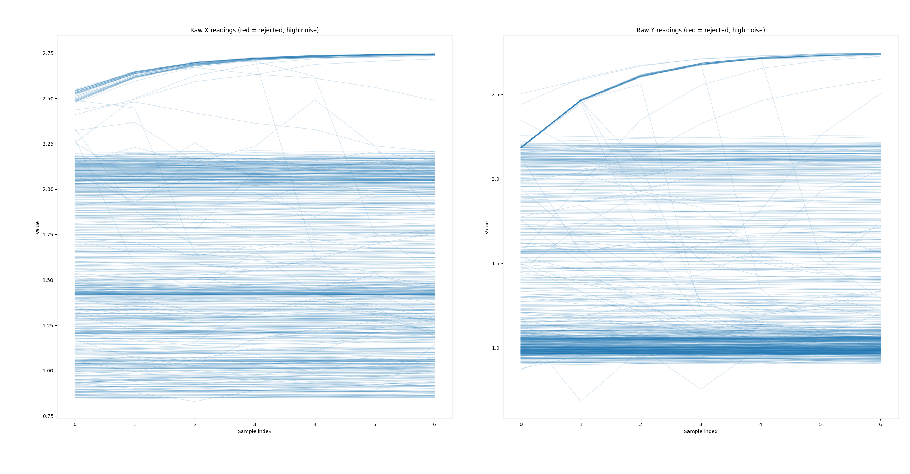
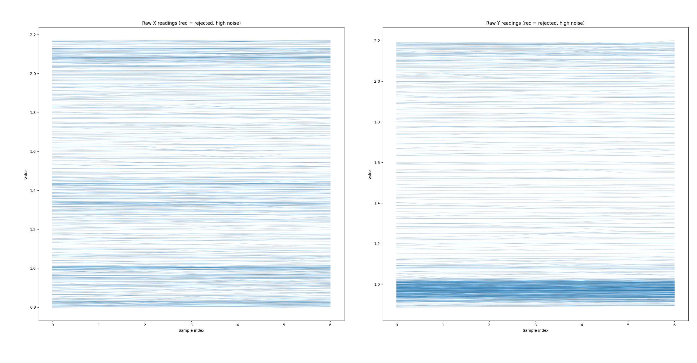

The first plot shows readings with no deviation filter applied — voltages scattered all over the range. The second shows the filtered readings, with red lines marking the points the filter eliminated.

### 5.2 Kalman Filter

The Kalman filter estimates both **position and velocity**. Velocity can't be measured directly from the touch panel, and naively deriving it from consecutive position readings produces large, false jumps — the ball appears to leap from one point to another in a fraction of a second, purely due to small sensing inaccuracies.

Once the deviation filter has removed unreliable readings, the Kalman filter is used to smooth and stabilize the ball's estimated position — and, critically, to eliminate the large jumps that appear when velocity is derived from raw position data.

**Why two filters:** the deviation filter rejects failed readings from the sensor at the source level, the Kalman filter then produces a smooth, accurate position (and velocity) estimate from the now reliable data. Running the Kalman filter directly on raw, unfiltered sensor data would let the occasional bad reading severely corrupt the estimate.

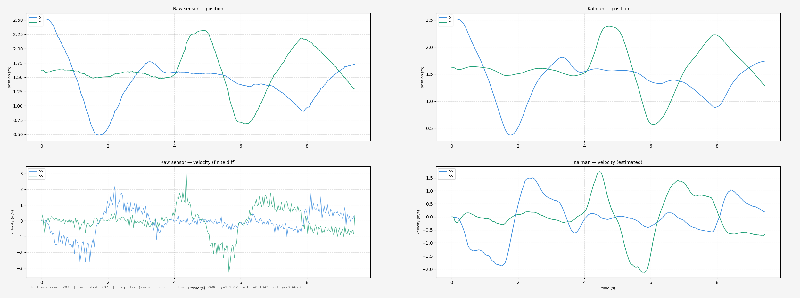

---

## 6. Control Systems

### 6.1 PID (Baseline)

A straightforward PID loop, tuned empirically directly on the nonlinear plant (no linearized model was used). Gains: **P = 0.2, I = 0.0, D = 0.075**.

### 6.2 Hyperbolic Sliding Mode Control (SMC)

The initial SMC implementation worked well in terms of tracking, but caused the servos to jitter violently — degrading their lifespan and producing a loud buzzing noise. This was resolved by replacing the standard sign function in the control law with a hyperbolic tangent function, which smooths the switching behavior and eliminates the chattering.

---

## 7. Results & Comparison

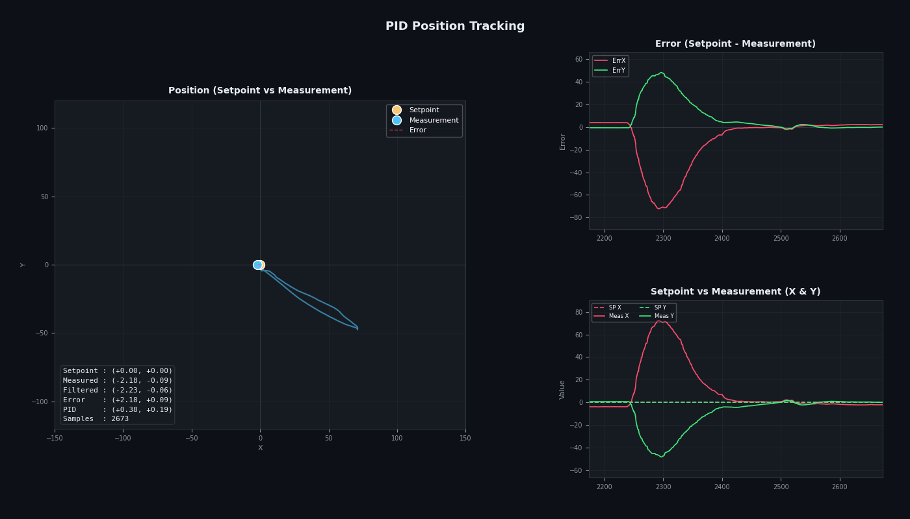
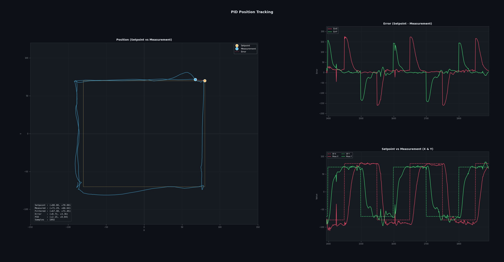
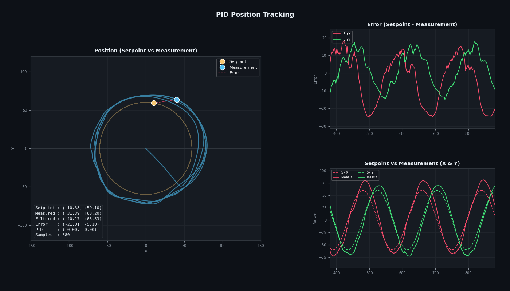
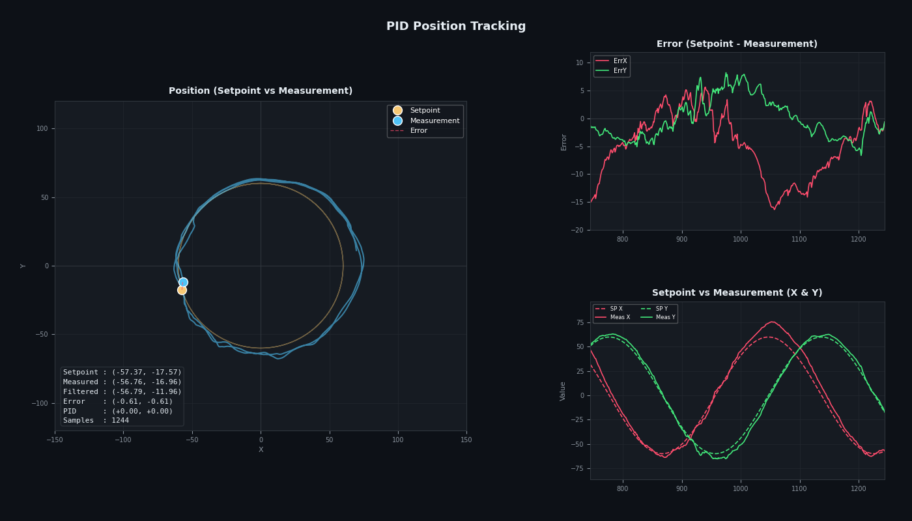
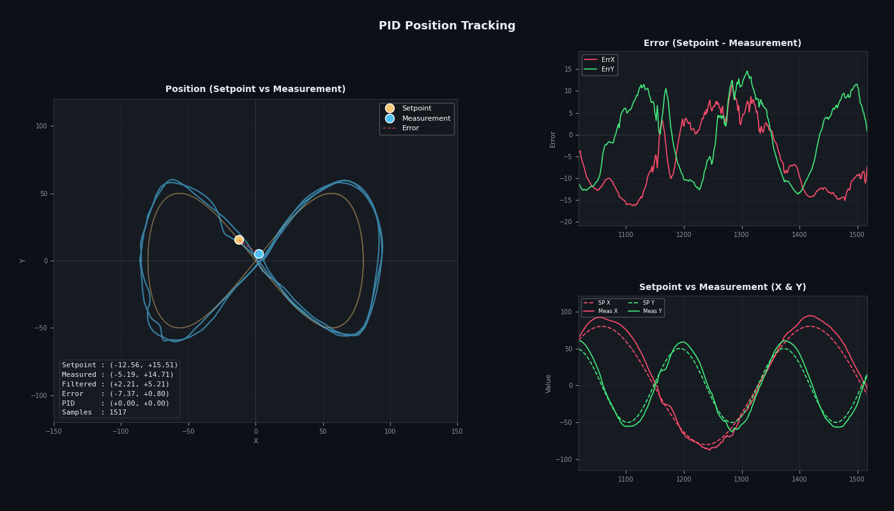

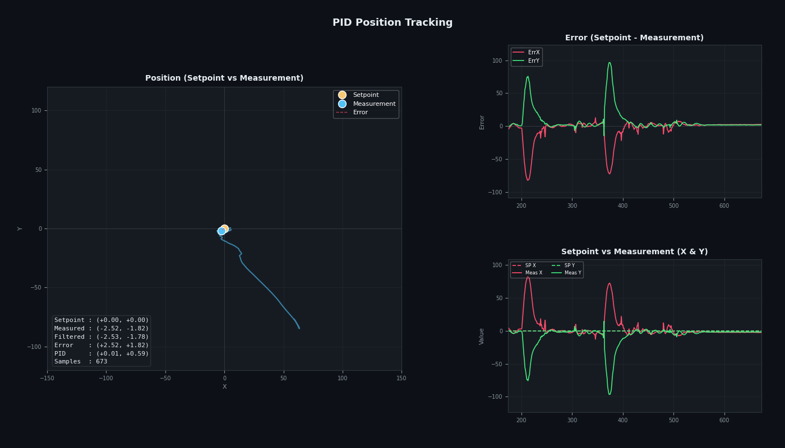
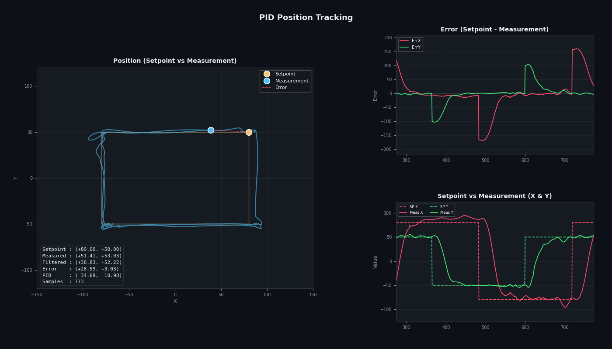

**Qualitative comparison (PID vs. SMC):**

The graphs above show tracking error over time alongside the ball's position in 2D space. SMC is consistently more robust: smaller steady-state error, faster approach speed, and better velocity handling than PID. PID, by contrast, overshoots and tends to leave the ball oscillating around the target rather than settling.

**Quantified results — holding center:**

| Metric | PID | SMC | Performance Impact |
| :--- | :--- | :--- | :--- |
| **Settling time** | ~3s | **~0.72s** | ~76% faster response speed |
| **Overshoot** | ~5-10mm | **2mm** | Up to 80% reduction in peak overshoot |
| **Steady-state error** | 1-2.5mm | **0.09-2mm** | Higher precision setpoint holding |

The gap widens further on continuous-path tracking. SMC follows curved paths like the circle and figure-8 smoothly, while PID fails to track them at all — which is why no PID graphs exist for those tests: the ball never followed the path closely enough to produce a meaningful result.

### Demo Video

📺 **[Watch the demo video](#)** <!-- TODO: replace with link -->

---

## 8. Limitations & Future Work

**Mechanical:**
- Combined servo angle limited to 35° to avoid the linkage striking the body
- Plate is not perfectly flat (laser-cut acrylic, slight warping)
- Small backlash from non-preloaded servo linkages
- Play in the central universal joint under high load, due to internal joint geometry (partially mitigated by tensioning the joint's core; a new connecting rod between plate and base is planned to eliminate this play entirely)

**Sensing:**
- The resistive touch panel produces false readings when the ball moves quickly across the plate, or when a violent tilt leaves the ball briefly airborne, losing position data at the most critical moments. A replacement is in development: an IR emitter and receiver grid, aimed at achieving accurate position sensing at a much faster sampling rate (1 kHz+).

**Planned next:**
- New communication protocol over HTTPS, paired with a deeper dashboard exposing more telemetry (including response time) and allowing more flexible commands to be sent to the microcontroller
- Additional control methods, including linearizing the model to properly test linear methods like LQR alongside PID
- A full mathematical simulation model, to eventually train an AI-based controller (learned/AI control)
- A redesigned connecting rod between the plate and base to fully eliminate central-joint play
- Integrating an IMU to automatically detect and correct for steady-state bias caused by bench misalignment, and to compensate for external lateral accelerations, helping the ball hold position while the plate itself is in motion

---

## Appendix
- Source code: [`/Components`](../Components)
- Media (video, plots): [`/images`](../docs/images)